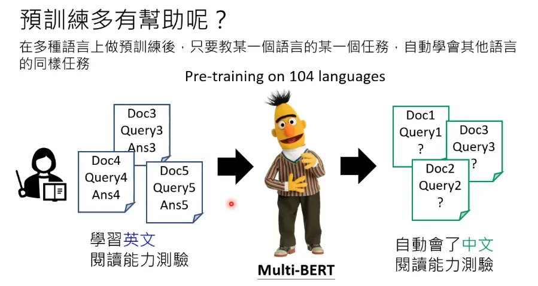

# 第1节 ChatGPT原理及生成式学习

## 1. 原理

实质上是文字接龙。通过一个训练得到的函数，根据使用者的输入，生成接龙的文字，判断下一次回答中哪个文字频率最大。

## 2. 四大学习范式

### 2.1 预训练（自监督学习）

1. 定义

通常采用**自监督学习**的方式。不需要人工标注的标签，而是从数据本身构造学习任务（监督信号），寻找出目标函数`f`，得到的模型被称为**基石模型（Foundation Model）**。

2. 作用

如在多种语言上做预训练后，只要教某一个语言的某一个任务，机器会自动学习其他语言的同样任务。

### 2.2 监督学习

1. 定义

由人类给出带标签的数据，每个输入都有对应的标准答案，交给机器进行学习训练。

2. 与自监督学习（预训练）的区别

预训练相当于学生自学，自己搜索资料，督促自己学习；而督导式学习相当于老师给学生上课。

### 2.3 无监督学习

1. 定义

只使用输入数据，没有标签，让模型发现数据中隐藏的结构和模式。

2. 与自监督学习的区别

自监督学习是"自己给自己出题目"，而无监督学习是"不做题目，只观察数据规律"。

### 2.4 增强式学习/强化学习

1. 定义

智能体（Agent）在环境中通过执行动作获得奖励或惩罚，从而学习如何做出最优决策的学习方法。