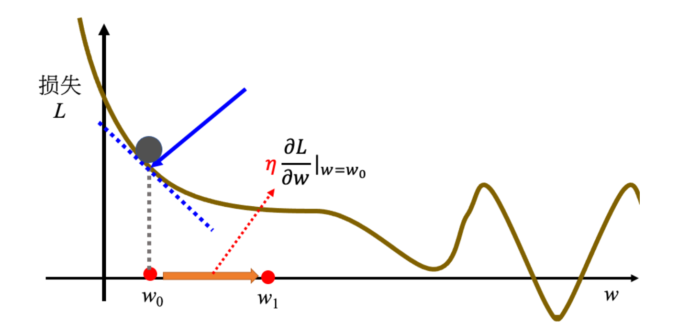

# 第2节 机器学习基础

### 1. 机器学习的概念

1. 定义

机器具备寻找到一个函数的能力，完成特定的任务。

2. 类别

根据要找的函数的不同，机器学习分为**回归**、**分类**、**结构化学习**几类。

- 回归（Regression）：函数的输出是一个数值/标量（scalar），如预测未来某一个时间的PM2.5的值。

- 分类（Classification）：函数的输出是一个类别（class），如预测邮箱中的邮件是否为垃圾邮件。

- 结构化学习（structured learning）：让机器生成有结构的物体，如画图、影像、诗句。

## 2. 机器学习的步骤

1. 定义函数

写出一个带有位置参数的函数 $f$ ,如 $y=b+wx$ ，其中 $w$ 称为权重（weight）， $b$ 称为偏置（bias）带有未知参数的函数称为**模型（model）**。

2. 定义损失（loss）

定义一个损失函数 $L(w,b)$ ，评估预测值与真实值/标签（label）之间的差距。常见的形式有：平均绝对误差（MAE）、均方误差（MSE）、交叉熵（cross entropy）等。

3. 解最优化问题

找出一对 $(w,b)$ ，使损失 $L$ 最小。通常采用**梯度下降（gradient descent）** 的方法。

$$ w^1\leftarrow w^0-\eta\frac{\partial L}{\partial w}｜_{w=w^0}$$

其中 $\eta$ 表示学习率（leaning rate），由自己设定，用于调整每次参数更新的步伐大小。这种自己设定，不是机器自己找出来的参数，被称为**超参数（hyperparameter）**。

